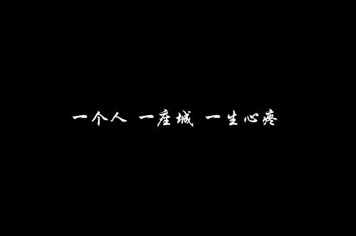

# 这是H1标题

*斜体字* 

**加粗**

<u>underline</u>

<a href="https://www.baidu.com" style="text-decoration:none">超链接</a>

无序列表
<ul>
<li>无序列表</li>
<li>无序列表</li>
<li>无序列表</li>
</ul>

有序列表
<ol>
<li>有序列表</li>
<li>有序列表</li>
<li>有序列表</li>
</ol>

[

](http://www.baidu.com "超链接图片")

2021/5/8 14:12:21 